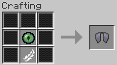
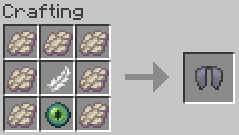
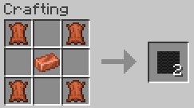
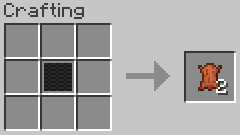
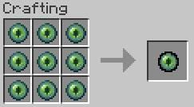
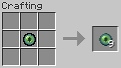

# elytra-recipe	
A simple fabric mod that adds a crafting recipe for elytra, along with a few other items
 
 
 

### Elytra Crafting Recipe
 
I am willing to rebalance this recipe but as of right now, it is mainly a proof of concept
 
 

### Vanilla Edition

The Vanilla Edition is a version of the mod which uses only vanilla items in the recipe.

The recipe in the Vanilla Edition

Download the latest version of the Vanilla Edition [here](https://github.com/AShadedBlobfish/elytra-recipe/releases/tag/vanilla-1.0.0)
  

### Kevlar (Standard Edition only)

Kevlar is an item added to be used to craft the Elytra. Real kevlar is made by weaving synthetic fabric, so the closest thing in the game is leather.
In my opinion, copper doesn't have enough uses in the game to justify its abundance, so I decided to add a copper ingot to the recipe

 

A single kevlar can be placed into a crafting table to obtain back it's leather, but the copper ingots cannot be returned
 

 

### Superb Eye of Ender (Standard Edition only)

The Superb Eye of Ender is crafted using 9 Eye of Ender and is used in crafting the Elytra

 

Like Kevlar, the Superb Eye of Ender can be placed into a crafting table to obtain back all 9 Eye of Ender
 

 

---------------------------

2025-12-07 Updated for 1.21.10
